Title: Preparing for an NLP interview - Day 2
Date: 2025-10-29 13:19
Category: Programming
Status: published

Okay, we're now in day 2. Yesterday I was kind of wrestling with whatever I could find on ABSA, trying to figure out what is the right approach to get some hands on experience. We settled for building an E2E ABSA model using BERT, which we based on a [paper](https://arxiv.org/pdf/1910.00883) from 2019 that does exactly that. I would like to continue with that, but first some side quests.

In the first part of the day I wasn't available to sit on the computer but I had my phone with me. Originally I thought I would use some LLM to do some Socratic practice, basically have it quiz me and teach stuff in NLP. But when it came to it, I couldn't really think of stuff to practice this way, though maybe I should have.

We did talk about the F-1 measure: I asked Gemini to test me, and it came up with a kind of exam question which required me to calculate the precision and recall for credit card fraud model given some statistics. This was actually good, because I realized I had a hard time remembering them, they are ever my slippery foes. I did eventually come up with the right formulas which are
$$P=\frac{TP}{TP+FP},\qquad R=\frac{TP}{TP+FN}$$
Then the F1 measure is just the harmonic mean (which I am ashamed to confess I also didn't remember correctly).

The next thing I did was try to recall the Viterbi Algorithm. For some context, the NLP task of POS tagging can be solved with a HMM model, which is a simple graphical model for observations with latent variables

```mermaid
graph LR
    %% Observations
    O1[O₁]
    O2[O₂]
    O3[O₃]
    O4[O₄]
    
    %% Hidden states
    S1((S₁))
    S2((S₂))
    S3((S₃))
    S4((S₄))
    
    %% Transitions between hidden states (horizontal)
    S1 --> S2
    S2 --> S3
    S3 --> S4
    
    %% Emissions from hidden to observed (vertical)
    S1 -.-> O1
    S2 -.-> O2
    S3 -.-> O3
    S4 -.-> O4
```

The joint distribution is then
$$P(O_{1...n},S_{1...n})=P(O_{1...n}|S_{1...n})P(S_{1...n})=\prod_i P(O_i|S_i)P(S_i|S_{i-1})$$
So for the model we need the emission distribution $P(O|S)$ and the transition distribution $P(S_i|S_{i-1})$. For POS we can extract this from a labeled corpus by counting. Then given the observations which are the tokens, we can look for the most likely POS assignment, since this is a generative model. The Viterbi algorithm makes this tractable with dynamic programming using the following observation.
$$P(O_{1...n},S_{1...n})=\prod_i P(O_i|S_i)P(S_i|S_{i-1})=P(O_n|S_n)P(S_n|S_{n-1})P(O_{1...n-1},S_{1...n-1})$$
If we remember for the best sequence probabilities of $P(O_{1...n-1},S_{1...n-1})$ for each choice of $S_{n-1}$ then we can quickly extend and calculate the best sequence probability for possible $S_n$, $P(O_{1...n},S_{1...n})$ by varying $S_{n-1}$ and check for which the RHS is best (I know this explanation is useless if you don't already know that).

So this is the idea of the Viterbi Algorithm. I don't know if HMMs are used today, but it appears in textbooks so solid to know.

Finally, I employed ChatGPT to search for NLP courses and the kind of assignments to offer, in hopes that doing existing exercises can save me the time of looking for the right resources and building up the code, which I felt took a lot of time yesterday. Some interesting ones:

- **HF Course – Token Classification (NER-style)**
    
    Build a token-tagger with 🤗 Transformers (alignment with word_ids(), label masking, Trainer). Good proxy for ATE/ABSA tagging. 
    
    _Covers:_ BIO tags, subword alignment, metrics.
- **HF Course – Extractive QA**

    Span-prediction pipeline on SQuAD-style data; clean example of start/end span heads. 
    
    _Covers:_ span labeling, context windows, post-processing.
- **Stanford CS224U – Sentiment HW + Bake-off**
    
    Supervised sentiment on SST-3 + restaurant reviews with baselines → open-ended improvements. 
    
    _Covers:_ error analysis, domain shift, model comparison.
- **Stanford CS224n – NMT with Attention (A3/A4 in recent runs)**
    
    Build/extend a seq2seq NMT system with attention & subwords. 
    
    _Covers:_ attention, BPE, teacher forcing, BLEU.

Doubt I'll have time for all, but I will start with the first one since it compliments what we wanted to do yesterday in a hand-holding way.

## HF Token Classification Notebook
[link](https://huggingface.co/learn/llm-course/en/chapter7/2)
It uses the conll2003 dataset, which seems to already break the sentence to tokens, and includes pos tags and ner tags for each token. So we can already ask now

- how do we handle the subword tokenization that bert does in terms of labels?
In terms of NER, here are the tokens
`Sequence(feature=ClassLabel(num_classes=9, names=['O', 'B-PER', 'I-PER', 'B-ORG', 'I-ORG', 'B-LOC', 'I-LOC', 'B-MISC', 'I-MISC'], names_file=None, id=None), length=-1, id=None)`

We move on to data preprocessing. Since we are using the `transformers` library a lot of stuff is going on behind the scenes. We'll try to keep note on what was "swept under the rug". We start by loading the `bert-base-cased` tokenizer. Already we can ask ourselves - what is this tokenizer, how is it trained and how does it process text. I hope we'll get to it later on this week, but for now we'll accept that it's a subword tokenizer (breaks space-delimited words further down) and go on. If we ask it to tokenize

`['EU', 'rejects', 'German', 'call', 'to', 'boycott', 'British', 'lamb', '.']`

we get

`['[CLS]', 'EU', 'rejects', 'German', 'call', 'to', 'boycott', 'British', 'la', '##mb', '.', '[SEP]']`

We notice a couple of things:

- It added special \[CLS\] and \[SEP\] tokens in the beginning and end. This has to do with the BERT model.
- It split the word lamb to two tokens: 'la' and '##mb'. This is the subword tokenization, since lamb wasn't part of its vocab. The ## prefix indicates this token is a continuation of the previous token.

Now to get back to the question we posed earlier, because of the subword tokenization property we can link back each token to the original index, thus recovering the label. The special BERT tokens we set to a special -100 label which tells the training loss to ignore these tokens. Since we have the BIO scheme we need to pay attention that a token like ##mb will be changed from B-? to I-? if tagged, or another option  is to set it to -100 as well. We define a function that aligns the labels so and map it over the dataset. Now we can compare

```python
raw_datasets['train'][0]

# output
{'id': '0',
 'tokens': ['EU',
  'rejects',
  'German',
  'call',
  'to',
  'boycott',
  'British',
  'lamb',
  '.'],
 'pos_tags': [22, 42, 16, 21, 35, 37, 16, 21, 7],
 'chunk_tags': [11, 21, 11, 12, 21, 22, 11, 12, 0],
 'ner_tags': [3, 0, 7, 0, 0, 0, 7, 0, 0]}
```

to 
```python
tokenized_datasets['train'][0]

# output
{'input_ids': [101,
  7270,
  22961,
  1528,
  1840,
  1106,
  21423,
  1418,
  2495,
  12913,
  119,
  102],
 'token_type_ids': [0, 0, 0, 0, 0, 0, 0, 0, 0, 0, 0, 0],
 'attention_mask': [1, 1, 1, 1, 1, 1, 1, 1, 1, 1, 1, 1],
 'labels': [-100, 3, 0, 7, 0, 0, 0, 7, 0, 0, 0, -100]}
```

Next up we need to do data collation, specifically we need to pad the input, since we want to work on batches of sentences, and sentences have variable lengths, and models can only work on tensors which means everything needs to be in the same length. But to do that we need to solve two problems:
- how to exclude the padded tokens from the attention calculations
- how to exclude the padded tokens from the loss calculations
For the first one we have the "attention_mask" parameter, and we reuse the -100 label for them.

The rest of the notebook goes thru creating a `compute_metrics` function which gives precision, recall, f1, accuracy results in general and per entity. Then we load the bert-cased model with the correct number of labels and set up the training args and start the Trainer loop. Of course, under the hood this hides a ton of stuff: optimization loop, loss function, learning rate, optimizer, LR schedule, batch size, regularization.

Okay. Now, by properly preparing the laptop14 dataset from yesterday we could pretty much copy and paste the rest of the notebook inside. Okay, the question now is how to build the dataset? [alexcadillon/SemEval2014Task4](https://huggingface.co/datasets/alexcadillon/SemEval2014Task4) on HF did a minimal parsing of the original XML to tabular data, where a row looks like this
```python
{'sentenceId': '2128', 'text': 'I liked the aluminum body.', 'aspectTerms': [{'term': 'aluminum body', 'polarity': 'positive', 'from': '12', 'to': '25'}]}
```
Now since we use the combined BIO+polarity tagging, the next task is to tokenize and then figure out which tokens have are an aspect, whether they're B or I and the polarity. In normal days I would try to write it myself, but again, focus, so I let GPT-5-Thinking do this, by giving it the current row and the desired row example. And it one shotted it... crazy. Just the basic approach:
- tokenize the text by using `finditer(r"\w+|[^\w\s]")` so a token is either a regex word or something thats not that and not spaces (so punctuation is separated). then extract to tokens and their spans.
- for each aspect in list go over all tokens in order, figure out which spans overlap, mark the first match with B+polarity and the rest with I+polarity.
This is basically brute-force, but fast enough in this case! an important point as well. 

Once we do that, then the rest is pretty much plug-n-play. In fact I tested it and the pipeline worked about the same. The next question is what the performance is. Evaluating on the test we get

```python
{'eval_loss': 0.31594014167785645,
 'eval_precision': 0.4222972972972973,
 'eval_recall': 0.39184952978056425,
 'eval_f1': 0.4065040650406504,
 'eval_accuracy': 0.9284659557013946,
 'eval_runtime': 4.4561,
 'eval_samples_per_second': 179.529,
 'eval_steps_per_second': 22.441,
 'epoch': 3.0}
```

Now to me it looks pretty bad compared to the BERT ABSA paper which gets

| P     | R     | F1    |
| ----- | ----- | ----- |
| 62.16 | 58.90 | 60.43 |

Tomorrow we will do some error analysis and hyperparam tuning, and hopefully go a step down in the abstraction stack.